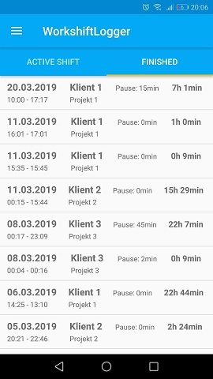
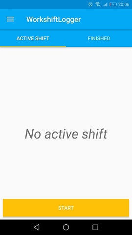
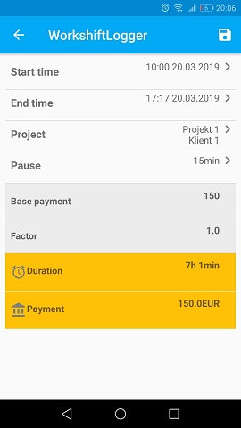
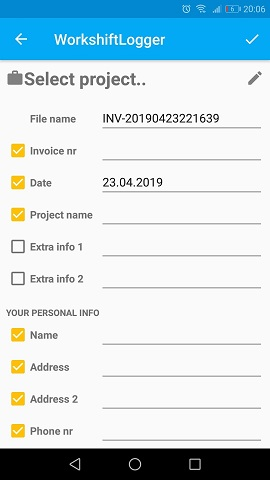

# Workshift Logger
Android app for tracking your working times and generating invoices.

[1. Description](https://github.com/zajan/workshift-logger#1-description)

[2. Architecture](https://github.com/zajan/workshift-logger#2-architecture)

[3. Possible improvements](https://github.com/zajan/workshift-logger#3-possible-improvements)

[4. Screenshots](https://github.com/zajan/workshift-logger#4-screenshots)

## 1. Description
The app is intended for users who work irregular hours and want to track them. It is also calculating the payment based on information given by user.

When calculating payment, application takes into account different rates for overhours. There are to modes possible: fixed payment for overhours or payment by factor which occurs in some professions. Based on calculated payments, user can automatically generate invoice. 

All the information about particular customers(companies) and projects can be stored and reused.

## 2. Architecture

The application is using MVC (model - view - controller) pattern.

It is designed with only one activity and multiple fragments.

Data is stored in the device internal storage. It is using SQLite database which implementation is in-built in Android system.

## 3. Possible improvements

- Store data on the server instead of local storage
- Add login module and security
- Change the architecture to MVP and refactor code
- Update UI
- Add more tests

## 4. Screenshots

